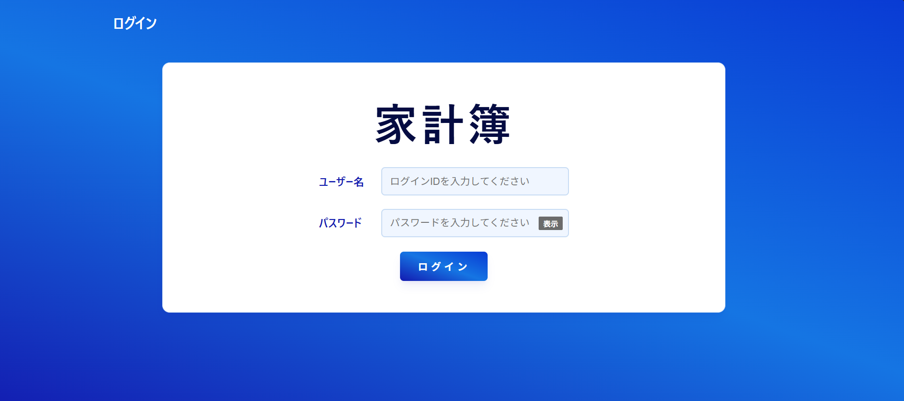
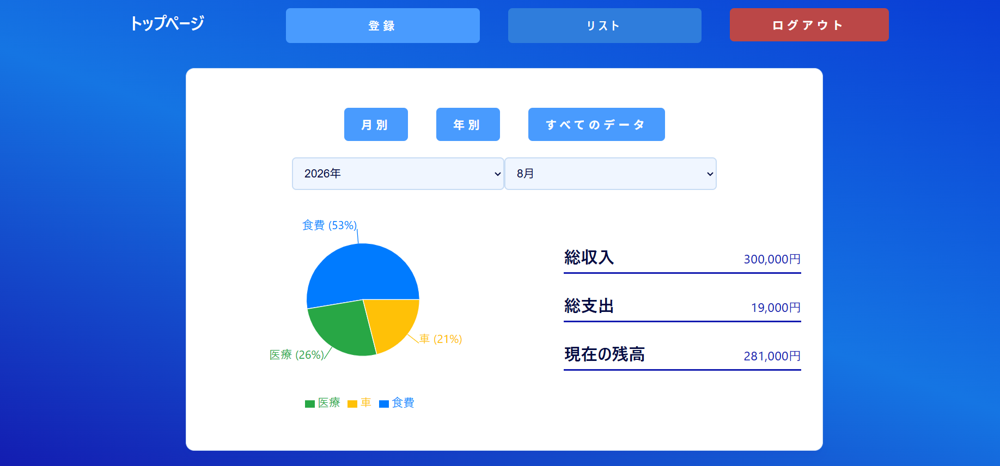
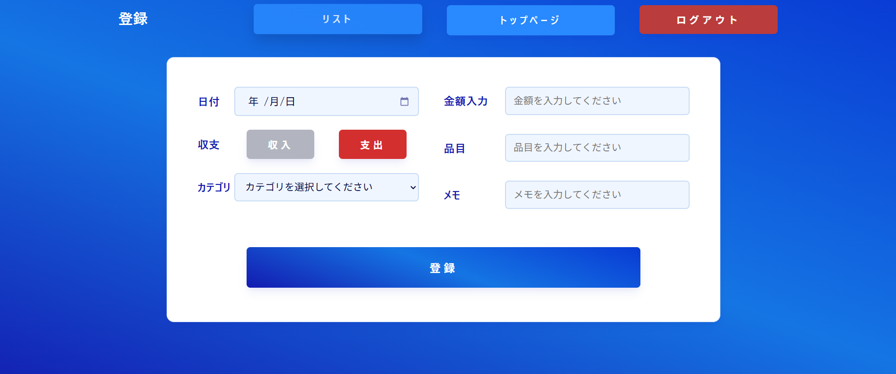
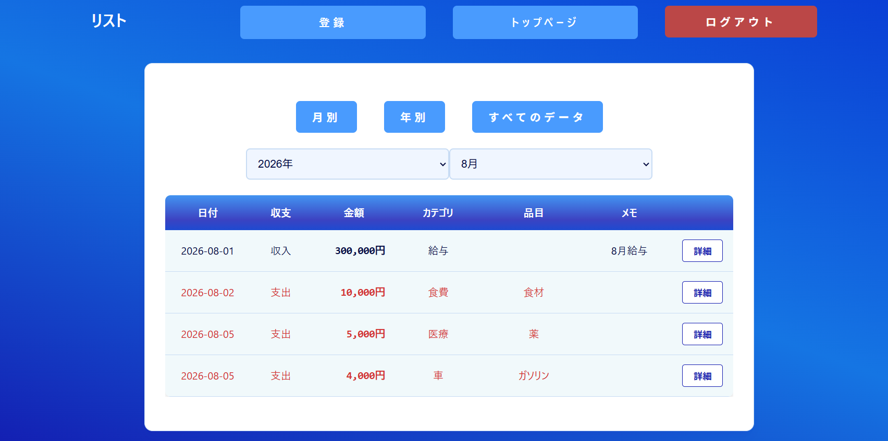
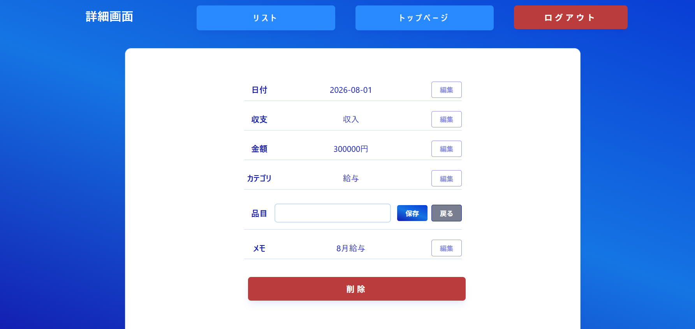
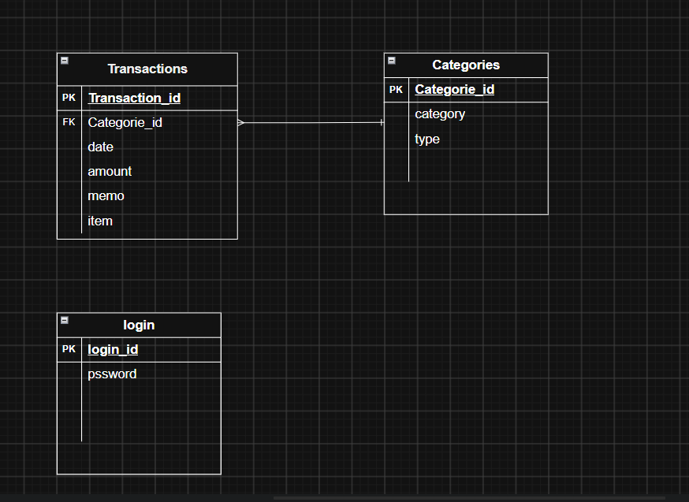

# 家計簿アプリ

日々の支出や収入を簡単に記録し、グラフで視覚的に管理できる家計簿アプリケーションです。
フロントエンドにReact、バックエンドにSpring Bootを採用し、データベースにはDocker上のMySQLを使用しています。

## アプリケーションURL

テスト用に実際に触っていただけるデプロイ先のURLです。

**URL:** [https://kakeibo-app-gamma-two.vercel.app/](https://kakeibo-app-gamma-two.vercel.app/)

### テスト用ログインアカウント

評価者の方が登録不要ですぐに確認できるよう、専用のアカウントを用意しています。

- **ログインID**: `user1`
- **パスワード**: `password`

---

## 開発背景・目的

### ターゲットと解決したい課題

「毎月何にお金を使っているか分からず、貯金ができない」という課題を持つ人をターゲットにしています。
**「手軽さ」と「直感的な視覚化」**に特化させました。

### 工夫したこと・こだわった点

- 収支を円グラフで確認できるようにし、無駄遣いをひと目で自覚できるUIにこだわりました。
- フロントエンドとバックエンドを完全に分離したフルスタック開発に挑戦し、APIの設計を工夫しました。

---

## 主な機能

- **収支入力機能**: カテゴリ（食費、交通費など）ごとの金額入力
- **データの保存・管理機能**: 入力したデータの確実な永続化
- **グラフ分析機能**: 支出割合を円グラフで可視化

---

## 画面イメージ

アプリの実際の操作画面です。

|                       ログイン画面                       |                     トップページ                     |
| :------------------------------------------------------: | :--------------------------------------------------: |
|  |  |

|                      登録画面                       |                      リスト画面                       |
| :-------------------------------------------------: | :---------------------------------------------------: |
|  |  |

|                       詳細・編集画面                        |
| :---------------------------------------------------------: |
|  |

---

## 使用技術（技術スタック）

| Category          | Technology Stack                     |
| :---------------- | :----------------------------------- |
| Frontend          | JavaScript / TypeScript, React, Vite |
| Backend           | Java, Spring Boot, Maven             |
| Database          | MySQL                                |
| Environment setup | Docker, Docker Compose               |

---

## ER図

データベースの設計図（エンティティ関係図）です。



---

## 使い方 / ローカル開発環境の構築

自身のPC環境で本アプリケーションを起動するためのセットアップ手順です。

### 1. 前提条件

事前に以下のツールをPCにインストールしてください。

- **Node.js** (フロントエンド実行用)
- **Docker Desktop** (データベース起動用)

### 2. セットアップ手順

ターミナル（またはコマンドプロンプト）を開き、以下のコマンドを順番に実行します。

#### ① リポジトリのクローンと移動

```bash
git clone <リポジトリのURL>
cd <プロジェクトのフォルダ名>
```

#### ② データベース（MySQL）の起動

```bash
docker-compose up -d
```

#### ③ バックエンドの起動

```bash
cd backend
# Windows環境の場合
.\mvnw.cmd spring-boot:run
# Mac / Linux環境の場合
./mvnw spring-boot:run
```

#### ④ フロントエンドの起動と確認

```bash
cd frontend/moz-todo-react
npm install
npm run dev
```

起動後、ブラウザで `http://localhost:5173` にアクセスするとアプリが利用可能です。
